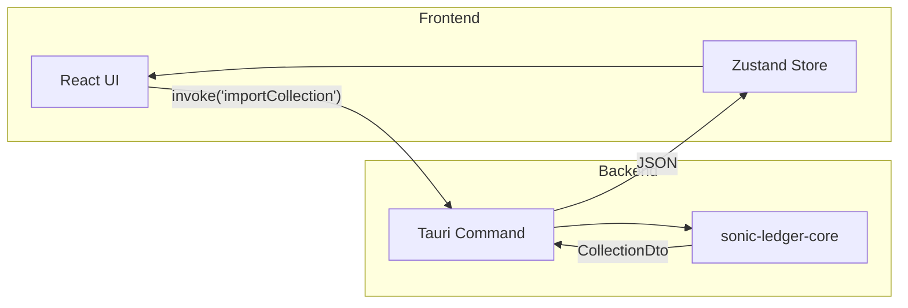
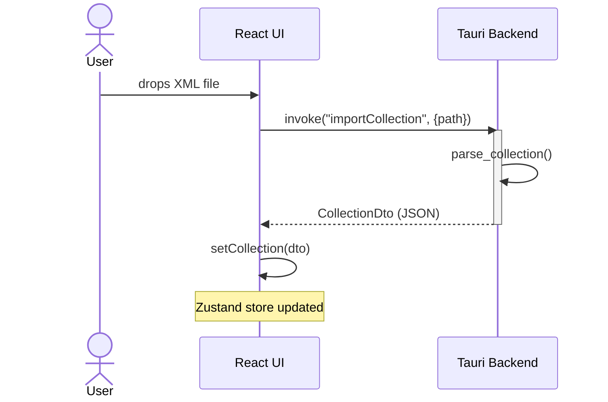
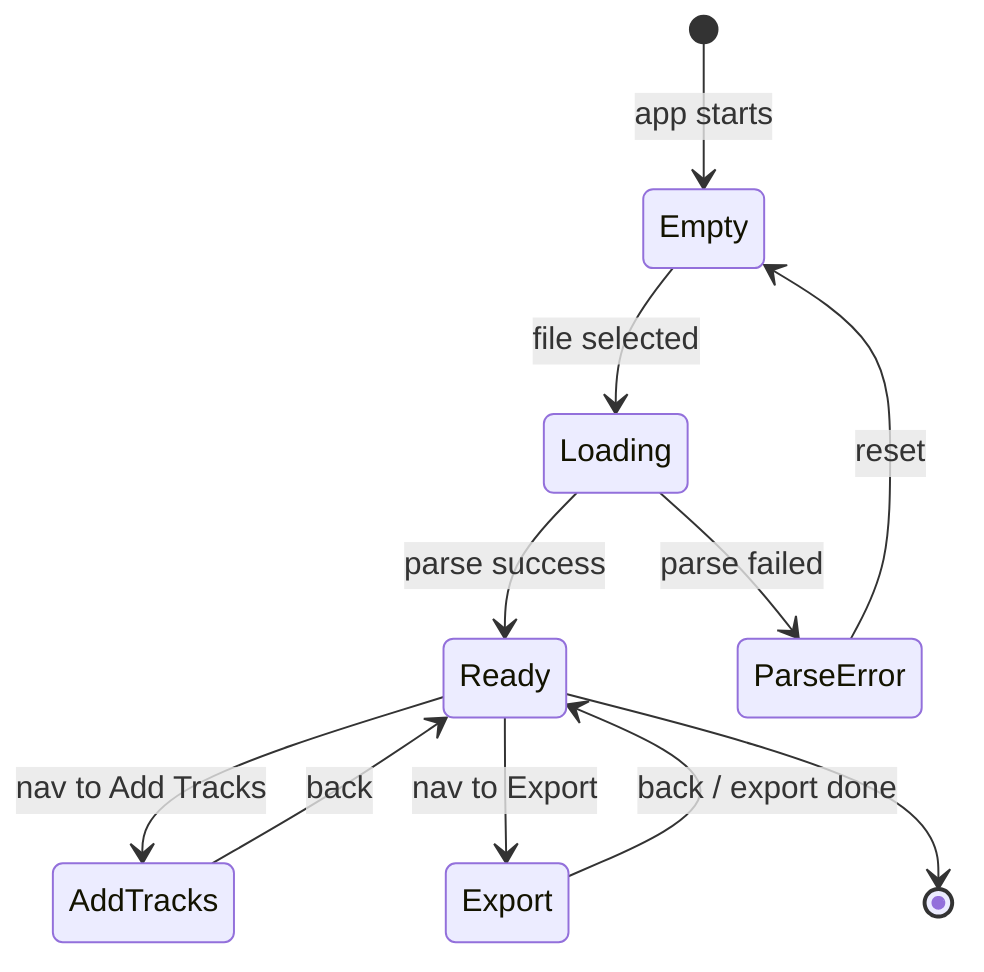
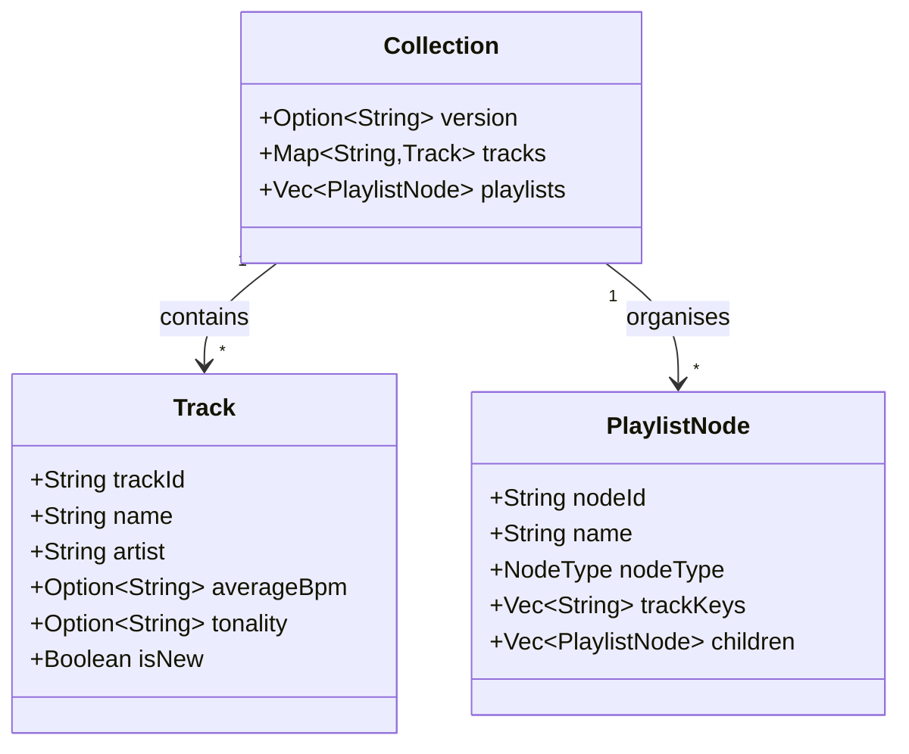

# Mermaid Diagrams

Produce clear, renderable Mermaid diagrams for communicating architecture, IPC flows, state machines, data models, and future system states.

---

## When to Diagram

Prefer a diagram over prose description whenever the design intent involves:

- Multiple interacting components, actors, or layers (→ `sequenceDiagram` or `flowchart`)
- A state machine, modal lifecycle, or navigation graph (→ `stateDiagram-v2`)
- Type hierarchies, domain models, or DTO relationships (→ `classDiagram`)
- A data pipeline or transformation chain (→ `flowchart LR`)
- A system architecture overview (→ `flowchart LR` with subgraphs, or `block-beta`)
- A project roadmap or slice progression (→ `timeline`)

---

## Diagram Type Selector

| What to show | Best type | Direction hint |
|---|---|---|
| Multi-actor call sequences — IPC, API, user flows | `sequenceDiagram` | n/a |
| State transitions — Zustand modes, app screens, modal lifecycle | `stateDiagram-v2` | n/a |
| System layers / architecture overview | `flowchart` with subgraphs | `LR` |
| Decision logic / process steps with branching | `flowchart` | `TD` |
| Type relationships, DTO/domain model | `classDiagram` | n/a |
| Data schema / table relationships | `erDiagram` | n/a |
| Linear pipeline — parse → transform → store | `flowchart` | `LR` |
| Project roadmap / slice timeline | `timeline` | n/a |

---

## Core Syntax — The 4 Essential Types

### 1. `flowchart`

Use `TD` for hierarchies and decision trees; use `LR` for pipelines and architecture layers.



**Node shapes**

| Syntax | Shape |
|---|---|
| `[text]` | Rectangle |
| `(text)` | Rounded rectangle |
| `{text}` | Diamond (decision) |
| `((text))` | Circle |
| `[/text/]` | Parallelogram (I/O) |

**Edge types**

| Syntax | Style |
|---|---|
| `-->` | Solid arrow |
| `-- label -->` | Labeled solid arrow |
| `-.->` | Dashed arrow |
| `==>` | Thick arrow |
| `---` | Line, no arrowhead |

**Subgraphs** group nodes into labeled regions — use them to separate Frontend from Backend, or core from shell:

```
subgraph GroupName
    A --> B
end
```

---

### 2. `sequenceDiagram`

Ideal for Tauri IPC round-trips, multi-step user flows, and any interaction involving two or more actors.



**Message arrows**

| Syntax | Meaning |
|---|---|
| `A->>B: msg` | Solid arrow (request / call) |
| `A-->>B: msg` | Dashed arrow (response / async) |
| `A-xB: msg` | Solid arrow, cross (failure / close) |

**Control structures**

```
loop Every frame
    A->>B: poll
end

alt Success
    B-->>A: data
else Error
    B-->>A: error
end

opt Only when logged in
    A->>B: fetch profile
end

Note over A,B: Shared note spanning both actors
```

---

### 3. `stateDiagram-v2`

Use for Zustand `activeScreen` state machines, modal lifecycles, or any finite set of app modes.



**Composite states** — group sub-states under a parent:

```
state Importing {
    [*] --> Scanning
    Scanning --> Parsing
    Parsing --> [*]
}
```

**Named states** (when label is long):

```
state "Parsing XML file" as Parsing
```

---

### 4. `classDiagram`

Use for domain model documentation, DTO relationships, or TypeScript interface hierarchies.



**Relationship types**

| Syntax | Meaning |
|---|---|
| `A --> B` | Association |
| `A --* B` | Composition (B owns A) |
| `A --o B` | Aggregation |
| `A ..|> B` | Implements interface |
| `A <|-- B` | B inherits from A |

**Visibility modifiers**: `+` public, `-` private, `#` protected, `~` package/internal.

---

## Best Practices

**One concern per diagram.** Don't try to show everything at once. A diagram covering "the whole app" is rarely readable. Split into: architecture overview, then IPC detail, then state machine.

**Direction aids comprehension.** `TD` (top-down) works for decision trees and class hierarchies. `LR` (left-right) works for pipelines, timeline-like sequences, and layered architecture.

**Quote labels that contain spaces or special characters.** Unquoted colons, brackets, and parentheses inside node labels break Mermaid parsing:

```
%% ❌ Breaks rendering
A[invoke("importCollection")]

%% ✅ Quoted label
A["invoke('importCollection')"]
```

**Keep node IDs short; put full text in the label.** `Rust["Tauri Backend"]` is preferable to `TauriBackend["Tauri Backend"]` — shorter IDs reduce line noise in complex diagrams.

**Always wrap output in a fenced code block with a heading.** Never drop a diagram inline without context:

```markdown
## Import Flow — IPC Sequence

\`\`\`mermaid
sequenceDiagram
...
\`\`\`
```

**Prefer concrete labels over abstract ones.** `invoke("importCollection")` beats `IPC call`. The diagram is a communication tool; specificity builds shared understanding.

---

## Output Checklist

Before returning a diagram:

- [ ] Fenced with ` ```mermaid ` (not ` ```mmd ` or ` ```markdown `)
- [ ] Preceded by a markdown heading naming the diagram's purpose
- [ ] Labels with spaces or special characters are quoted
- [ ] Node IDs don't collide (each is unique within the diagram)
- [ ] Direction (`TD` / `LR`) matches the flow being shown
- [ ] Subgraphs used to separate system boundaries where relevant

---

## Additional Resources

### Reference Files

For exhaustive syntax on all diagram types, including edge cases and rendering gotchas:

- **`references/diagram-types.md`** — Complete syntax for `flowchart`, `sequenceDiagram`, `stateDiagram-v2`, `classDiagram`, `erDiagram`, `timeline`, `block-beta`, and a common pitfalls reference.

Load this reference when:
- Using a diagram type not covered above
- An `erDiagram` or `timeline` is needed
- Hitting a rendering error and need to check syntax rules
- Advanced features like `classDef` styling or `par`/`and` in sequence diagrams are required
